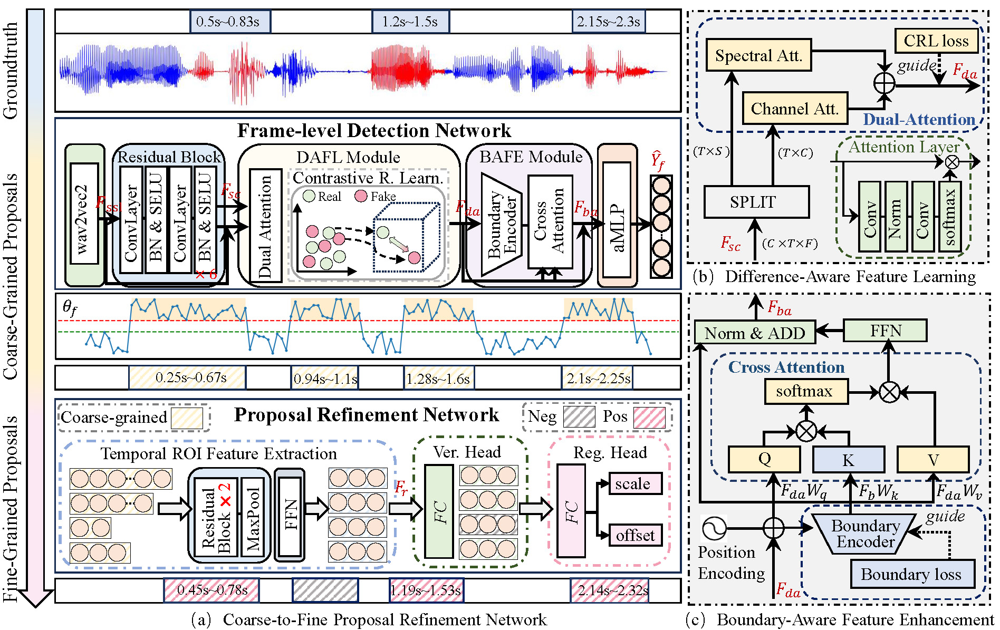

# Coarse-to-Fine Proposal Refinement Framework for Audio Temporal Forgery Detection and Localization

**Authors**: [Junyan Wu](https://www.researchgate.net/profile/Wu-Junyan-5/research), [Wei Lu (Corresponding author)](https://cse.sysu.edu.cn/content/2461), [Xiangyang Luo](https://ieeexplore.ieee.org/author/37399489600), [Rui Yang](https://orcid.org/0009-0008-7446-7216), [Qian Wang](https://orcid.org/0000-0002-8967-8525), [Xiaochun Cao](https://scst.sysu.edu.cn/members/caoxiaochun.htm).

Coarse-to-Fine Proposal Refinement Framework (CFPRF) is designed to predict audio temporal forgery proposals. It contains a frame-level detection network (FDN) in the first stage to learn robust representations for better indicating rough forgery regions and employs a proposal refinement network (PRN) in the second stage to produce fine-grained proposals. [PaperLink](http://arxiv.org/abs/2407.16554).




## 1. Setup


It is recommended that you install Python 3.8 or higher. We followed the installation setup in this project [SSL_Anti-spoofing](https://github.com/TakHemlata/SSL_Anti-spoofing), which is presented as follows:


```bash
conda create -n SSL python=3.8 numpy=1.23.5
conda activate SSL
pip install torch==1.8.1+cu111 torchvision==0.9.1+cu111 torchaudio==0.8.1 -f https://download.pytorch.org/whl/torch_stable.html
--------------install fairseq for XLSR--------------
git clone https://github.com/TakHemlata/SSL_Anti-spoofing.git
cd fairseq-a54021305d6b3c4c5959ac9395135f63202db8f1
pip install --editable ./
```


## 2. For Testing 
We provide checkpoints and corresponding output results, which can be downloaded from [GoogleDrive](https://drive.google.com/drive/folders/1ygN-9v9bfZPKu9aLaGD6WKR_ld8vtGsz?usp=sharing). Put them on this folder:
```
./checkpoints
├── 1FDN_HAD.pth
├── 1FDN_LAVDF.pth
├── 1FDN_PS.pth
├── 2PRN_HAD.pth
├── 2PRN_LAVDF.pth
├── 2PRN_PS.pth
```

### 2.1 Run 🚀

Evaluating checkpoints for different datasets to get the results:

 - ```python evaluate_CFPRF.py --eval --dn PS --save_path ./results```

 - ```python evaluate_CFPRF.py --eval --dn HAD --save_path ./results```

 - ```python evaluate_CFPRF.py --eval --dn LAVDF --save_path ./results```

If you want to produce results from a saved '.npy' file, then remove `--eval` from the above command.


### 2.2 PDF Evaluation Results

| **Dataset** | **EER** | **AUC** | **PRE** | **REC** | **F1** |
|-------------|---------|---------|---------|---------|--------|
| HAD         | 0.08    | 99.96   | 99.98   | 99.92   | 99.95  |
| PS          | 7.41    | 96.97   | 95.23   | 92.59   | 93.89  |
| LAV-DF      | 0.82    | 99.89   | 99.95   | 99.18   | 99.56  |


### 2.3 TFL Evaluation Results

| **Dataset** | **AP@0.5** | **AP@0.75** | **AP@0.95** | **mAP** | **AR@20** |
|-------------|------------|-------------|-------------|---------|-----------|
| HAD         | 99.77      | 99.60       | 96.03       | 99.23   | 99.38     |
| PS          | 66.34      | 55.47       | 40.96       | 55.22   | 66.53     |
| LAV-DF      | 94.52      | 93.47       | 88.64       | 93.01   | 93.51     |


## 3. For Training

### 3.1 Run 🚀

The first stage is to train the Frame-level Detection Network (FDN):

 - ``` python train_stage1.py --dn PS --num_epoch 30 --save```

The second stage is to train the Proposal Refinemant Network(PRN):

 - ``` python train_stage2.py --dn PS --num_epoch 50 --save```

## Acknowledgements
This repository thanks several open-source projects: [PartialSpoof[1]](https://github.com/nii-yamagishilab/PartialSpoof), [TDL-ADD[2]](https://github.com/xieyuankun/TDL-ADD), [SSLAS[3]](https://github.com/TakHemlata/SSL_Anti-spoofing), [Wav2vec[4]](https://github.com/facebookresearch/fairseq/tree/main/examples/wav2vec/xlsr). 

```
@article{10003971,
  title={The PartialSpoof Database and Countermeasures for the Detection of Short Fake Speech Segments Embedded in an Utterance}, 
  author={Zhang, Lin and Wang, Xin and Cooper, Erica and Evans, Nicholas and Yamagishi, Junichi},
  journal={IEEE/ACM Transactions on Audio, Speech, and Language Processing}, 
  year={2023},
  volume={31},
  number={},
  pages={813-825},
  doi={10.1109/TASLP.2022.3233236}}
```

```
@inproceedings{xie2024efficient,
  title={An Efficient Temporary Deepfake Location Approach Based Embeddings for Partially Spoofed Audio Detection},
  author={Xie, Yuankun and Cheng, Haonan and Wang, Yutian and Ye, Long},
  booktitle={ICASSP 2024-2024 IEEE International Conference on Acoustics, Speech and Signal Processing (ICASSP)},
  pages={966--970},
  year={2024},
  organization={IEEE}
}
```

```
@inproceedings{tak2022automatic,
  title={Automatic speaker verification spoofing and deepfake detection using wav2vec 2.0 and data augmentation},
  author={Tak, Hemlata and Todisco, Massimiliano and Wang, Xin and Jung, Jee-weon and Yamagishi, Junichi and Evans, Nicholas},
  booktitle={The Speaker and Language Recognition Workshop},
  year={2022}
}
```

```
@article{babu2021xlsr,
      title={XLS-R: Self-supervised Cross-lingual Speech Representation Learning at Scale}, 
      author={Arun Babu and Changhan Wang and Andros Tjandra and Kushal Lakhotia and Qiantong Xu and Naman Goyal and Kritika Singh and Patrick von Platen and Yatharth Saraf and Juan Pino and Alexei Baevski and Alexis Conneau and Michael Auli},
      year={2021},
      volume={abs/2111.09296},
      journal={arXiv},
}
```

## Citation
Kindly cite our work if you find it useful.


```
@article{wu2024cfprf,
  title={Coarse-to-Fine Proposal Refinement Framework for Audio Temporal Forgery Detection and Localization},
  author={Wu, Junyan and Lu, Wei and Luo, Xiangyang and Yang, Rui and Wang, Qian and Cao, Xiaochun},
  journal={arXiv preprint arXiv:2407.16554},
  year={2024},
  doi={10.1145/3664647.3680585},
}
```
