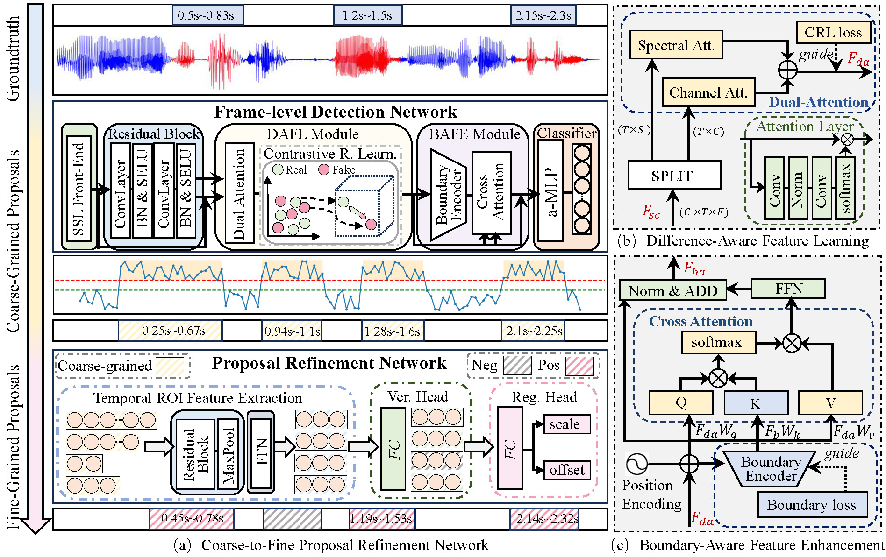

# Coarse-to-Fine Proposal Refinement Framework for Audio Temporal Forgery Detection and Localization

**Authors**: [JunyanWu](https://www.researchgate.net/profile/Wu-Junyan-5/research), [Wei Lu (Corresponding author)](https://cse.sysu.edu.cn/content/2461), [Xiangyang Luo](https://ieeexplore.ieee.org/author/37399489600) , [Rui Yang](https://openreview.net/profile?id=~Rui_Yang18), [Qian Wang](https://openreview.net/profile?id=~Qian_Wang13), [Xiaochun Cao](https://scst.sysu.edu.cn/members/caoxiaochun.htm).

**Abstract**:
Recently, a novel form of audio partial forgery has posed challenges to its forensics, requiring advanced countermeasures to detect subtle forgery manipulations within long-duration audio. However, existing countermeasures still serve a classification purpose and fail to perform meaningful analysis of the start and end timestamps of partial forgery segments. To address this challenge, we introduce a novel coarse-to-fine proposal refinement framework (CFPRF) that incorporates a frame-level detection network (FDN) and a proposal refinement network (PRN) for audio temporal forgery detection and localization. Specifically, the FDN aims to mine informative inconsistency cues between real and fake frames to obtain discriminative features that are beneficial for roughly indicating forgery regions. The PRN is responsible for predicting confidence scores and regression offsets to refine the coarse-grained proposals derived from the FDN. To learn robust discriminative features, we devise a difference-aware feature learning (DAFL) module guided by contrastive representation learning to enlarge the sensitive differences between different frames induced by minor manipulations. We further design a boundary-aware feature enhancement (BAFE) module to capture the contextual information of multiple transition boundaries and guide the interaction between boundary information and temporal features via a cross-attention mechanism. Extensive experiments show that our CFPRF achieves state-of-the-art performance on various datasets, including LAV-DF, ASVS2019PS, and HAD.

## Code and pre-trained models are coming soon!